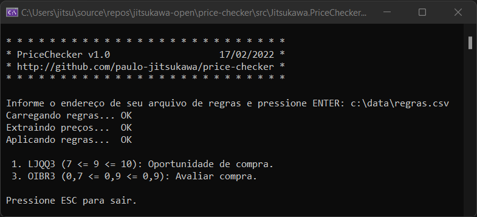

# Price Checker

Ferramenta que auxilia a identificação de oportunidades de compra e venda de ações e cotas de fundos de investimento imobiliário (FIIs) negociadas na bolsa de valores do Brasil ([B3](https://www.b3.com.br)).

Price Checker permite registrar uma lista indefinida de ativos e suas respectivas janelas de preço-alvo. Assim que solicitada, a aplicação exibe quais ativos atingiram os valores desejados para negociação.

Este software não é destinado ao *day trade* e operações de alta frequência.

## 1. Aplicação

A aplicação é uma ferramenta de linha de comando que aceita o endereço do Arquivo de Regras (ver tópico 3) como único parâmetro de entrada. Caso esse dado seja omitido ou informado de maneira incorreta, a aplicação irá solicitar que o respectivo caminho seja digitado no prompt de comando. 

## 2. Projeto

- Desenvolvido em [.NET](https://dotnet.microsoft.com/download) 6 no Visual Studio 2022.

- Pode ser aberto, alterado, compilado e executado no [Visual Studio](https://visualstudio.microsoft.com/pt-br/) ou [Visual Studio Code](https://code.visualstudio.com).

- Implementa um *web crawler* que extrai os dados do último pregão concluído na B3.

- Código escrito para ser eficaz e não eficiente, uma vez que a aplicação é destinada para o uso pessoal.

## 3. Arquivo de Regras

Cada linha do arquivo deve ser composta por um comentário ou uma regra. As linhas de comentário devem iniciar com **#** e não serão processadas. Sua utilidade é registrar alguma observação do usuário. As linhas de regras contém os critérios de comparação de preços de ativos definidos pelo usuário. Cada uma delas deve obedecer ao formato abaixo.

```xml
<ticker>;<minimo>;<maximo>;<mensagem>
```

- ***ticker*** - código do papel no pregão da B3;

- ***minimo*** - preço mínimo que o ativo deve alcançar para tornar a regra válida;

- ***maximo*** - preço máximo que o ativo deve alcançar para tornar a regra válida;

- ***mensagem*** - texto que deve ser exibido quando a regra for válida.

<small>Obs.: o conteúdo das posições 1 (*ticker*) e 4 (*mensagem*) podem estar entre aspas e todo o conteúdo cuja posição for superior a 4 será ignorado pela aplicação (comentário oculto).</small>

Exemplo:

```
# Meu arquivo de regras
PETR4 ; 40.50 ; 50 ; Oportunidade de vender.
VALE3 ; 70.50 ; 80.50 ; Oportunidade de alugar.
FIIB11; 400; 450; Oportunidade de comprar.
```

## 4. Resultado

Quando o valor de um ativo entrar no intervalo de preços de uma regra, esta se tornará válida e será exibida em uma lista com as demais regras que forem válidas. Desta forma, o Price Checker produz como resultado uma lista de ativos que devem ter a atenção do usuário.



---
